## Part 1. Готовый докер

1. Взял официальный докер образ с nginx и выкачал его при помощи docker pull

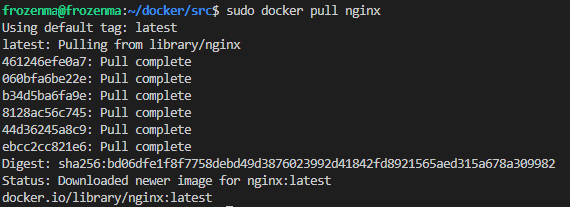

2. Проверил наличие докер образа через docker images

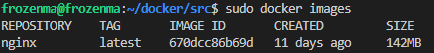

3. Запустил докер образ через docker run -d [image_id]

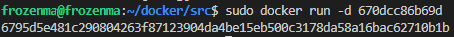

4. Проверил, что образ запустился через docker ps

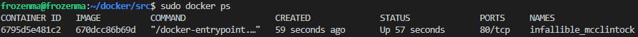

5. Посмотрел информацию о контейнере через docker inspect [container_id]

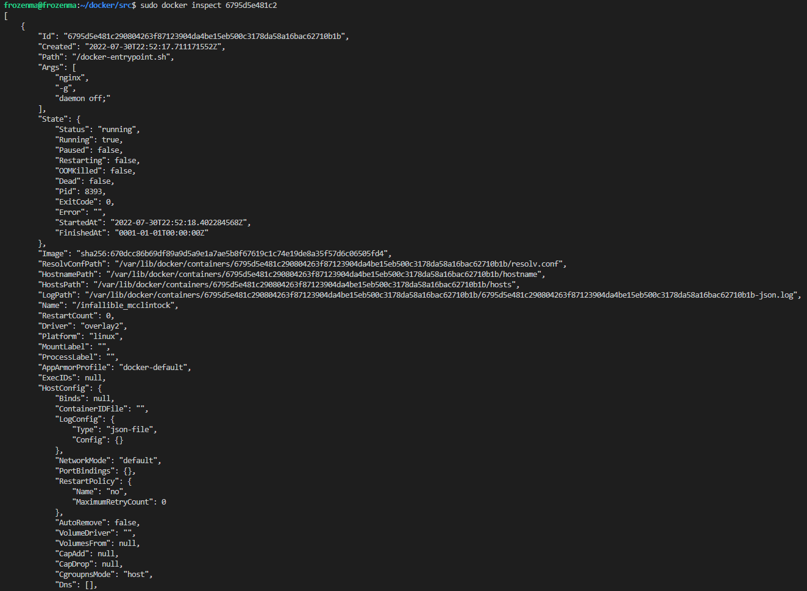

6. По выводу команды определил и поместил в отчёт размер контейнера, список замапленных портов и ip контейнера

    * размер контейнера - 142MB
    * список замапленных портов - "80/tcp": null
    * ip контейнера - "172.17.0.3"

7. Остановил докер образ через docker stop [container_id]

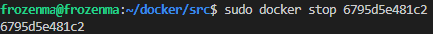

8. Проверил, что образ остановился через docker ps

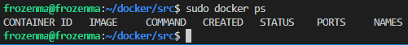

9. Запустил докер с замапленными портами 80 и 443 на локальную машину через команду run

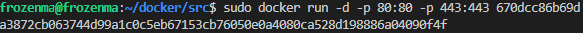

10. Проверил, что в браузере по адресу localhost:80 доступна стартовая страница nginx

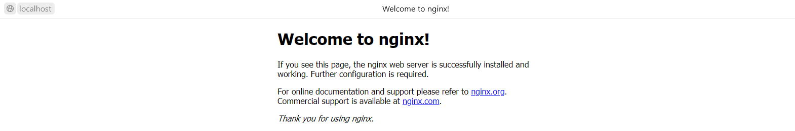

11. Перезапустил докер контейнер через docker restart [container_id]

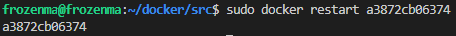

12. Проверил любым способом, что контейнер запустился

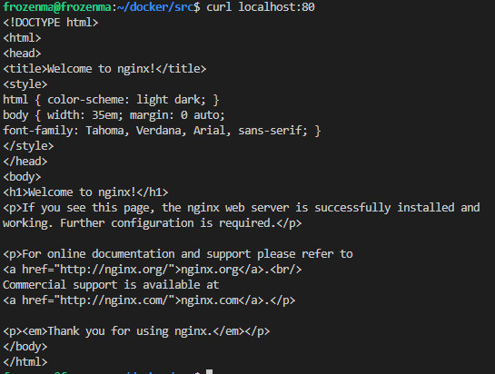

## Part 2. Операции с контейнером

1. Прочитал конфигурационный файл nginx.conf внутри докер образа через команду exec

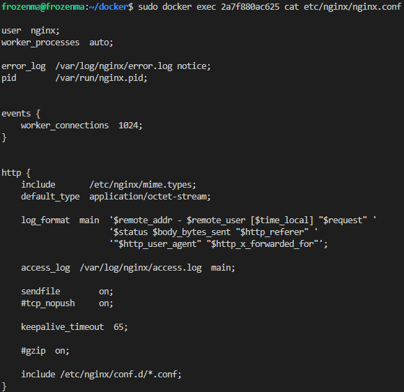

2. Создал на локальной машине файл nginx.conf

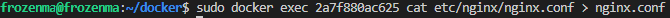

3. Настроил в нем по пути /status отдачу страницы статуса сервера nginx

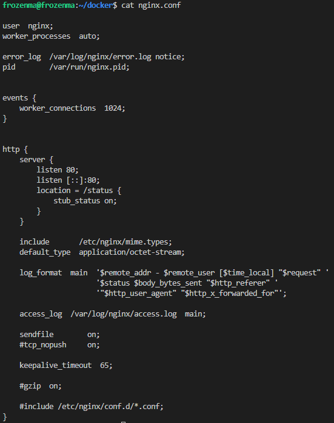

4. Скопировал созданный файл nginx.conf внутрь докер образа через команду docker cp

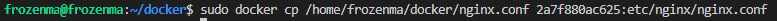

5. Перезапустил nginx внутри докер образа через команду exec

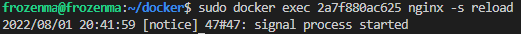

6. Проверил, что по адресу localhost:80/status отдается страничка со статусом сервера nginx

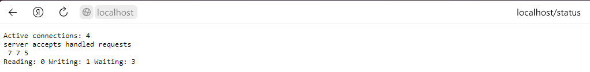

7. Экспортировал контейнер в файл container.tar через команду export

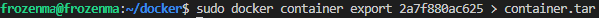

8. Остановил контейнер

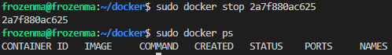

9. Удалил образ через docker rmi [image_id], не удаляя перед этим контейнеры

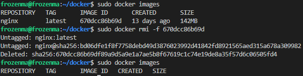

10. Удалил остановленный контейнер

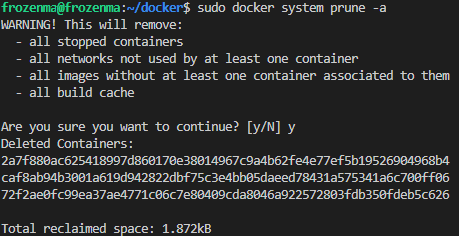

11. Импортировал контейнер обратно через команду import

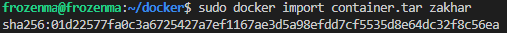

12. Запустил импортированный контейнер

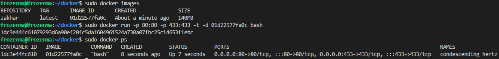

13. Проверил, что по адресу localhost:80/status отдается страничка со статусом сервера nginx

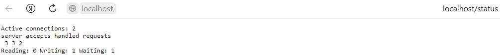

## Part 3. Мини веб-сервер

1. Написал мини сервер на C и FastCgi, который будет возвращать простейшую страничку с надписью Hello World!

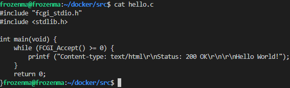

2. Запустил написанный мини сервер через spawn-fcgi на порту 8080

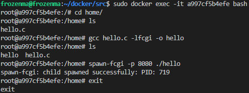

3. Написал свой nginx.conf, который будет проксировать все запросы с 81 порта на 127.0.0.1:8080

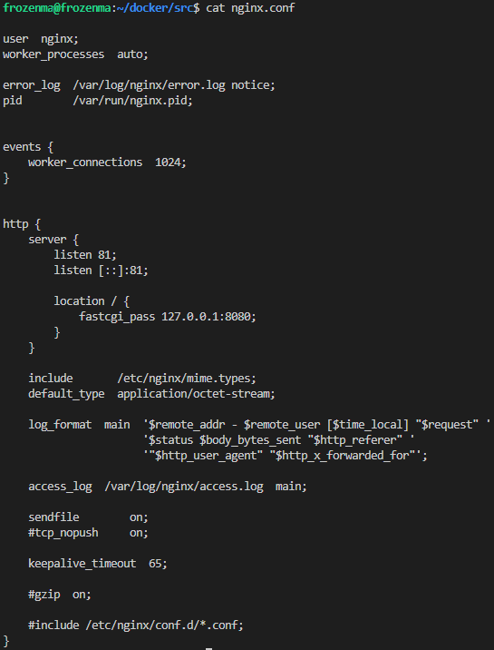

4. Проверил, что в браузере по localhost:81 отдается написанная вами страничка

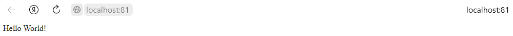

5. Положил файл nginx.conf по пути ./nginx/nginx.conf (это понадобится позже)

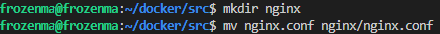

## Part 4. Свой докер

### 1. Написал свой докер образ, который:

    1) собирает исходники мини сервера на FastCgi из Части 3;

    2) запускает его на 8080 порту;

    3) копирует внутрь образа написанный ./nginx/nginx.conf;

    4) запускает nginx.

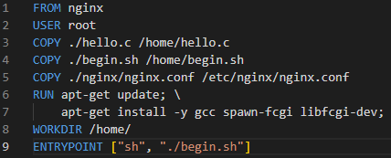

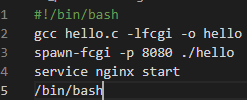

2. Собрал написанный докер образ через docker build при этом указав имя и тег

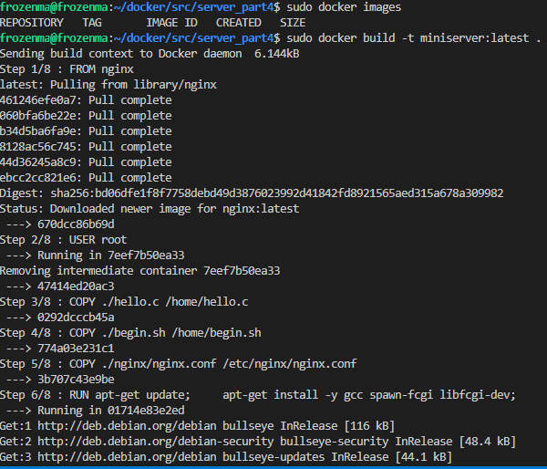

3. Проверил через docker images, что все собралось корректно

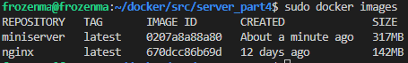

4. Запустил собранный докер образ с маппингом 81 порта на 80 на локальной машине и маппингом папки ./nginx внутрь контейнера по адресу, где лежат конфигурационные файлы nginx'а (см. Часть 2)

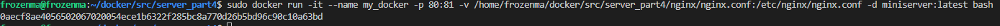

5. Проверить, что по localhost:80 доступна страничка написанного мини сервера

6. Дописал в ./nginx/nginx.conf проксирование странички /status, по которой надо отдавать статус сервера nginx

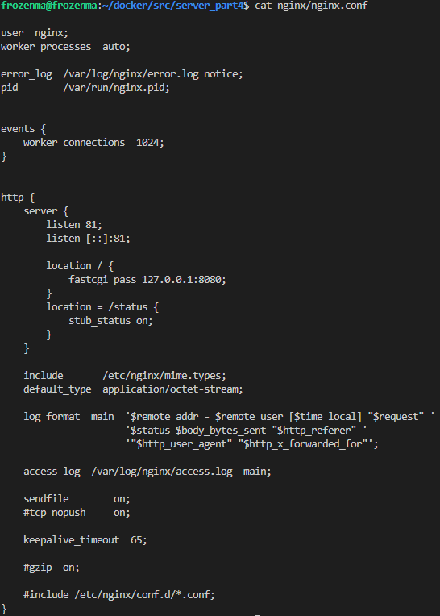

7. Перезапустил докер образ

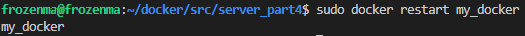

8. Проверил, что теперь по localhost:80/status отдается страничка со статусом nginx

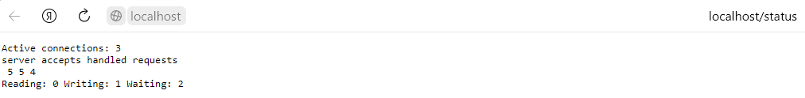

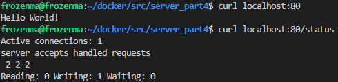

## Part 5. Dockle

1. Просканировал образ из предыдущего задания через dockle [image_id]

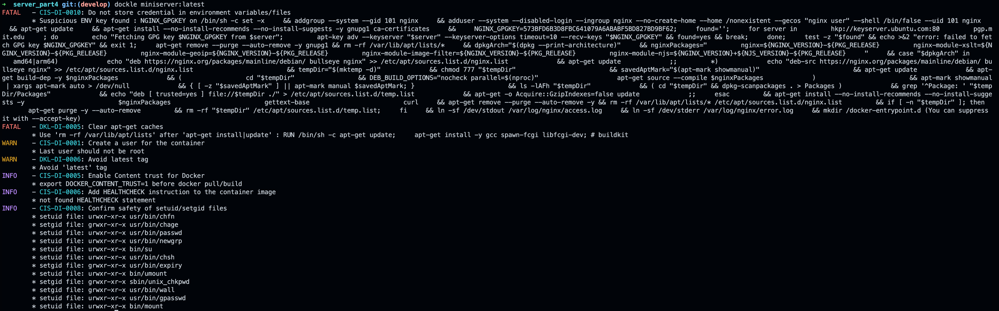

2. Собрал написанный докер образ через docker build при этом указав тег отличный от 'latest'

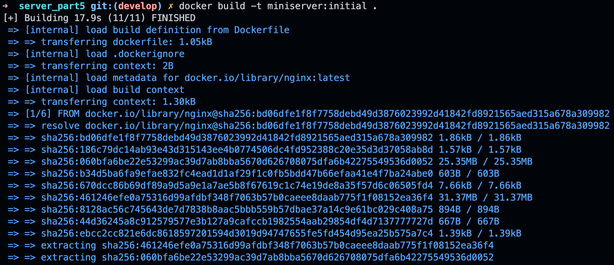

3. Исправил образ так, чтобы при проверке через dockle не было ошибок и предупреждений

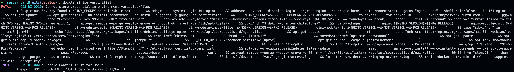

## Part 6. Базовый Docker Compose

### 1. Написал файл docker-compose.yml, с помощью которого:

    1) Поднял докер контейнер из Части 5 (он должен работать в локальной сети, т.е. не нужно использовать инструкцию EXPOSE и мапить порты на локальную машину)

    2) Поднял докер контейнер с nginx, который будет проксировать все запросы с 8080 порта на 81 порт первого контейнера

    3) Замапил 8080 порт второго контейнера на 80 порт локальной машины

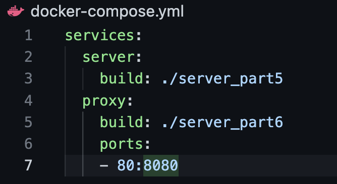

2. Проверил, что в браузере по localhost:80 отдается написанная вами страничка, как и ранее

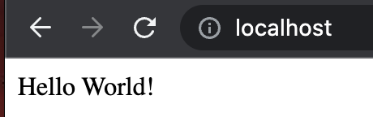